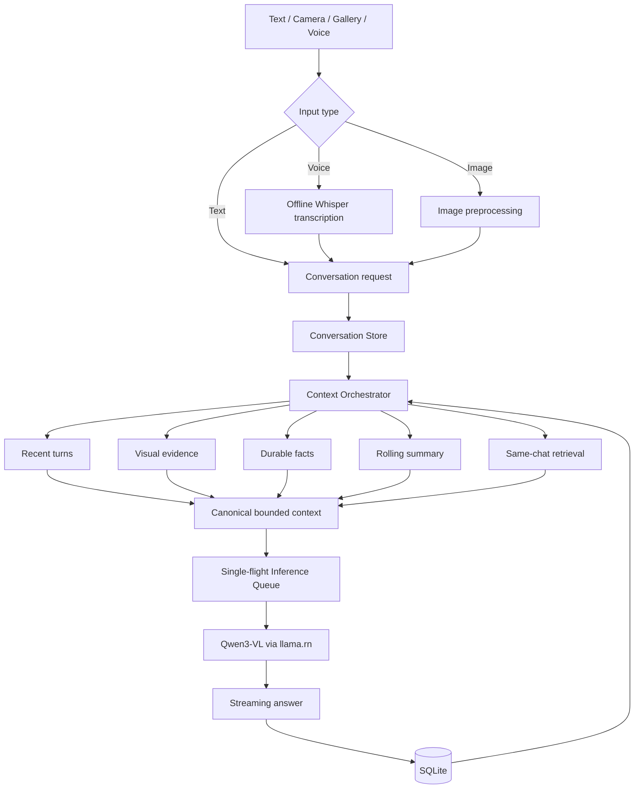

# Locra

<p align="center">
  <strong>Private, multimodal AI that runs entirely on your phone.</strong>
</p>

<p align="center">
  
  
  
  
  
  
</p>

Locra is an Android-first, privacy-focused AI assistant for text, images, and voice. It runs a quantized **Qwen3-VL-2B-Instruct** vision-language model directly on the device through `llama.rn`, transcribes speech locally with **Whisper**, and stores conversations, image evidence, summaries, facts, and diagnostics in local storage.

After the model files are downloaded, Locra's inference path does not require an internet connection.

<!-- Add a short demo GIF or 2–3 product screenshots here before a public launch. -->

## Why Locra?

Most multimodal AI applications send prompts, images, audio, and conversation history to a remote server. Locra explores a different architecture:

- **Private by default** — prompts, images, audio, and conversations remain on the device.
- **Offline-capable** — text, image, and voice workflows continue without network access after setup.
- **Multimodal** — ask questions using text, camera images, gallery images, or dictated speech.
- **Persistent local memory** — Locra retains relevant context from the current conversation without uploading it.
- **No inference API bill** — model execution happens on the user's hardware.
- **Resilient mobile architecture** — model integrity checks, transactional database migrations, recovery UI, cancellation, and resource coordination are treated as first-class product concerns.

## Features

### On-device AI

- Qwen3-VL-2B-Instruct `Q4_K_M` language model.
- Qwen3-VL `Q8_0` multimodal projector.
- `llama.rn` 0.12.5 runtime.
- CPU-first inference with a bounded 4,096-token context window.
- Streamed responses with stop, retry, regenerate, and continuation handling.
- Low, Medium, and High response modes.
- Detection and cleanup of truncated or repetitive model output.

### Image understanding

- Capture an image using the camera or select one from the gallery.
- Ask direct questions about objects, text, layout, condition, and visual details.
- Preprocess images before native inference to reduce memory pressure.
- Persist durable image attachments inside app-controlled storage.
- Extract reusable visual evidence for follow-up questions in the same conversation.
- Preserve image thumbnails and local context after an app restart.

### Offline voice input

- Record speech inside the chat composer.
- Transcribe locally with `whisper.rn` and `whisper.cpp`.
- Uses the quantized Whisper Base English `q5_1` model.
- Displays recording state, timer, cancellation, and transcription progress.
- Inserts one final editable transcript into the composer.
- Never auto-sends dictated text.
- Keeps the voice model separate from the Qwen model so either can be managed independently.

### Local conversation intelligence

- SQLite is the canonical source of truth for conversations and model-derived context.
- Recent exact turns are combined with relevant same-chat memory.
- Durable visual evidence, extracted facts, and rolling summaries support longer conversations.
- Hybrid retrieval architecture includes lexical fallback and versioned embedding persistence.
- Context is selected under explicit response-mode budgets before it reaches the model.
- Cross-chat context injection is intentionally excluded from the active product flow.

### History and controls

- Persistent local conversation history.
- Search, open, rename, and delete conversations.
- Copy and share user or assistant messages.
- Stop, retry, regenerate, or continue responses.
- Per-conversation response-mode persistence.
- Production-safe diagnostics export without intentionally exposing raw local paths.

### Model lifecycle and recovery

- Background model downloads with progress reporting.
- Exact model manifests with pinned filenames, byte sizes, and SHA-256 checksums.
- Independent verification of the language model and multimodal projector.
- Stale or incomplete native download-task recovery.
- Transactional SQLite migrations with schema-version stamping.
- Recovery screen with Retry, Export diagnostics, and explicitly confirmed local-data reset.
- No silent deletion or recreation of production conversations after a migration failure.

## Architecture



### Data and state boundaries

| Layer | Responsibility |
| --- | --- |
| React Native screens/components | User interface only |
| Zustand stores | Reactive application state and UI coordination |
| XState inference lifecycle | Preparation, model loading, streaming, cancellation, and terminal states |
| SQLite | Canonical conversations, messages, attempts, image metadata, evidence, chunks, facts, summaries, embeddings, and benchmarks |
| MMKV | Lightweight settings, lifecycle flags, and bounded diagnostic metadata |
| `llama.rn` | Qwen inference and local embedding runtime boundary |
| `whisper.rn` | Offline speech-to-text runtime |
| Background downloader | Resumable model acquisition and progress notifications |

## Model artifacts

Locra V1 uses one pinned Qwen bundle:

| Artifact | Quantization | Approximate size |
| --- | --- | ---: |
| Qwen3-VL-2B-Instruct language model | `Q4_K_M` | 1.11 GB |
| Qwen3-VL multimodal projector | `Q8_0` | 445 MB |
| Whisper Base English | `q5_1` | 59.7 MB |

The files are downloaded during setup rather than committed to the repository. Every required artifact must match its expected filename, size, and SHA-256 digest before Locra marks the model ready.

## Technology stack

| Area | Technology |
| --- | --- |
| Mobile | React Native 0.85.3, Expo SDK 56 |
| Language | TypeScript |
| Main model | Qwen3-VL-2B-Instruct |
| LLM/VLM runtime | `llama.rn` 0.12.5 |
| Speech recognition | `whisper.rn` 0.6.0, Whisper Base English `q5_1` |
| Camera | React Native Vision Camera |
| Persistence | Expo SQLite |
| Fast settings storage | React Native MMKV |
| State management | Zustand |
| Lifecycle orchestration | XState |
| Navigation | React Navigation |
| Animation/worklets | Reanimated, Worklets, Gesture Handler |
| Testing | Jest, Jest Expo, TypeScript, ESLint |
| Android build | Gradle, CMake, NDK 26.3.11579264 |

## Project structure

```text
src/
├── components/            Shared UI and chat components
├── diagnostics/           Privacy-safe diagnostics and export
├── inference/             Context assembly, extraction, generation, and lifecycle
│   └── llamaRn/           Qwen llama.rn runtime adapter
├── media/                 Durable image handling
├── model/                 Model manifests, downloads, integrity, and readiness
├── navigation/            Application routing and bootstrap
├── persistence/           SQLite repositories and schema
│   └── sqlite/            Database, migrations, and development reset tools
├── retrieval/             Chunking, lexical retrieval, embeddings, and backfill
├── screens/               Product screens
├── store/                 Zustand stores and application coordinators
├── voice/                 Offline recording and Whisper runtime
└── types/                 Shared domain types

tests/
├── contract/
├── integration/
├── unit/
└── helpers/

specs/                     Spec-driven feature plans, contracts, and tasks
modules/model-integrity/   Native model-integrity hashing module
```

## Getting started

### Prerequisites

- Node.js 22
- npm
- JDK 17
- Android Studio and Android SDK
- Android NDK `26.3.11579264`
- CMake
- An ARM64 physical Android device is recommended
- At least 4 GB of free device storage for models, build artifacts, and app data

The first Android build compiles native C/C++ dependencies such as `llama.cpp` and `whisper.cpp`, so it can take significantly longer than a typical React Native build.

### Install dependencies

```bash
npm ci
```

### Validate the project

```bash
npm run type-check
npm run lint
npm test -- --runInBand
npx expo-doctor
npx expo config --type public
npx expo export --platform android
```

### Run on Android

```bash
npx expo prebuild --platform android
npx expo run:android
```

After the development client is installed:

```bash
npm run start:dev-client
adb reverse tcp:8081 tcp:8081
```

### Build a local release APK on Windows

For a connected ARM64 physical device:

```powershell
$env:CMAKE_BUILD_PARALLEL_LEVEL="2"

cd android

.\gradlew.bat generateCodegenArtifactsFromSchema `
  --no-daemon `
  --max-workers=2 `
  --no-parallel

.\gradlew.bat assembleRelease `
  -PreactNativeArchitectures=arm64-v8a `
  --no-daemon `
  --max-workers=2 `
  --no-parallel
```

The APK is generated at:

```text
android/app/build/outputs/apk/release/app-release.apk
```

Do not repeatedly run `gradlew clean`. It forces large native libraries to compile again.

## Privacy model

Locra separates model acquisition from inference:

```text
Network allowed:
model and configuration download

Network not required:
text inference
image inference
voice transcription
conversation retrieval
history
summaries and facts
diagnostics generation
```

The application does not require a backend for its core intelligence. Future cloud functionality, such as encrypted cross-device backup, should remain optional and must not become a dependency of the local inference path.

## Current project status

Locra is in a **physical-device alpha** stage.

Implemented:

- On-device Qwen text and vision inference.
- Offline Whisper voice transcription.
- Background model downloads and native integrity verification.
- Same-chat context orchestration and durable image evidence.
- SQLite conversation persistence, migrations, and recovery.
- Response modes, cancellation, retry, regeneration, and continuation.
- History, sharing, diagnostics, and Android release APK generation.

Active validation and improvement areas:

- Image-answer quality across diverse real-world photos.
- Long-conversation memory quality and compaction behavior.
- Full activation and evaluation of the optional semantic embedding pipeline.
- Performance across a wider range of Android hardware.
- iOS build and runtime validation.
- Accessibility and final product-polish testing.

## Engineering highlights

Locra is more than a wrapper around a local model. The project addresses the systems work required to make on-device multimodal AI usable:

1. **Native resource coordination** — prevents Qwen, Whisper, embedding, and model-management work from competing unsafely.
2. **Bounded context construction** — controls memory use and selects only relevant current-conversation context.
3. **Durable multimodal memory** — stores image evidence separately from temporary preprocessed files.
4. **Versioned local intelligence** — tracks model hashes, embedding versions, source revisions, summary versions, and schema versions.
5. **Failure recovery** — handles interrupted downloads, cancelled inference, migration failures, and incomplete generated answers.
6. **Privacy-safe observability** — produces useful diagnostics while keeping detailed raw traces development-only.

## Roadmap

- Complete physical-device quality benchmarks for text, image, and voice.
- Activate and evaluate the local embedding model for semantic same-chat retrieval.
- Move compaction and embedding backfill to a persistent local job queue.
- Improve performance on lower-memory Android devices.
- Add encrypted, optional cross-device backup without changing the offline-first architecture.
- Validate and ship the iOS build.
- Prepare Play Store release and public contribution documentation.

## Contributing

This project uses spec-driven development. Start with:

```text
.specify/memory/constitution.md
AGENTS.md
specs/
```

Before submitting a change, run:

```bash
npm run type-check
npm run lint
npm test -- --runInBand
```

Keep the inference path offline, preserve SQLite as the canonical conversation store, and avoid introducing a required backend dependency.

## Author

Built by [Vineet Agarwal](https://github.com/vineetagarwal54).

## License

A repository license has not yet been added. Add an OSI-approved license before accepting external contributions or distributing modified versions.
